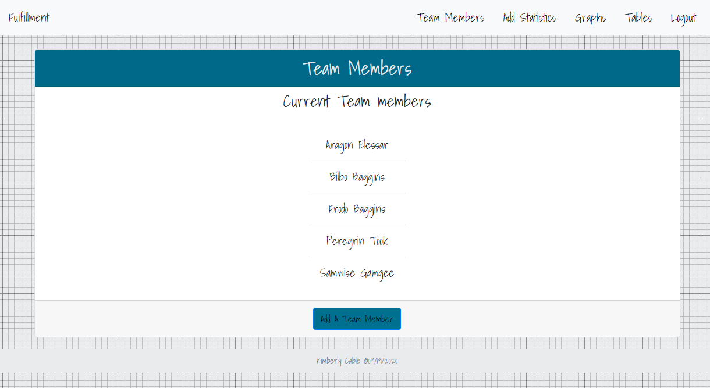
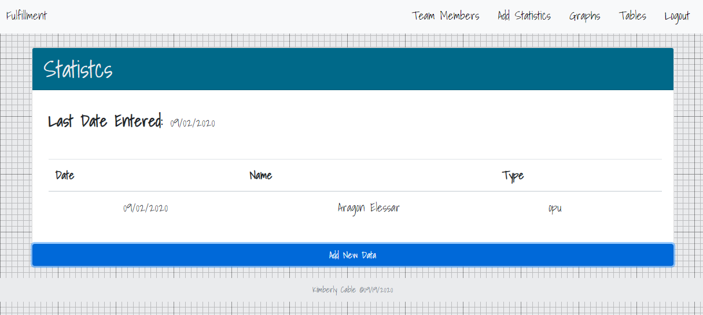
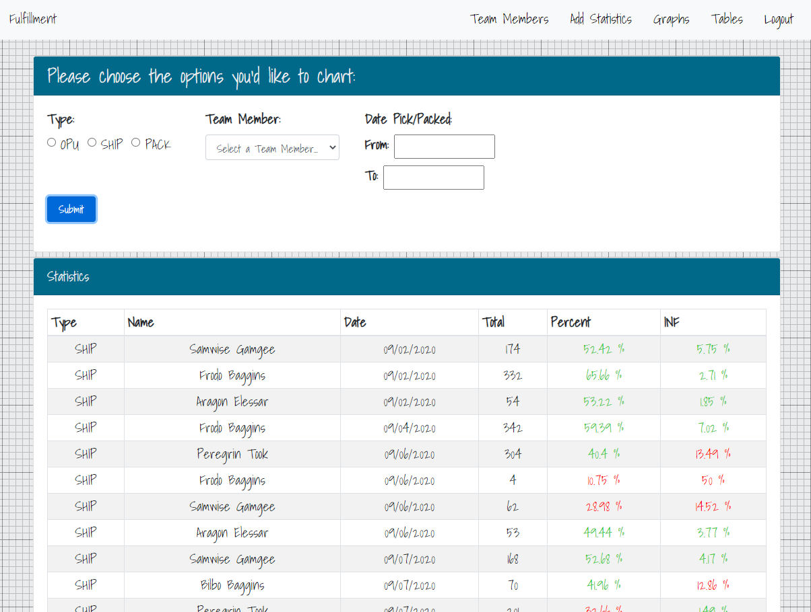
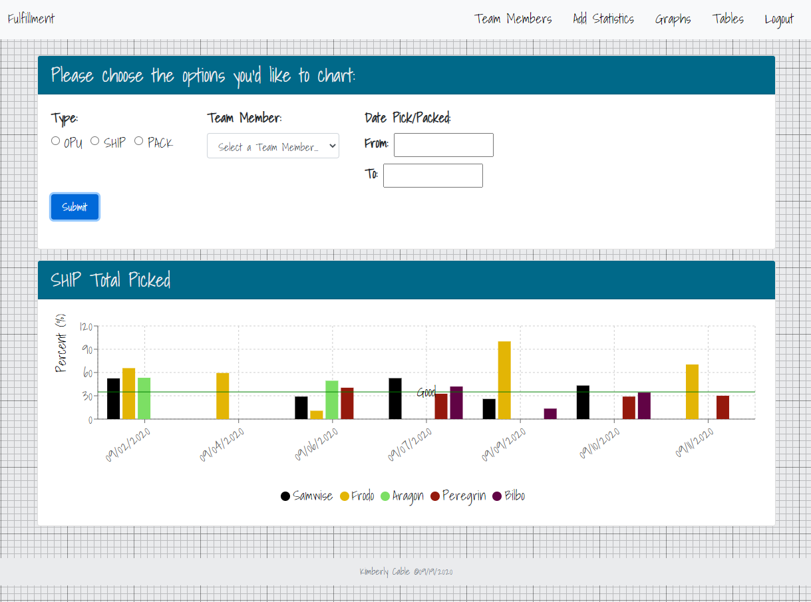

# Fulfillment

## Purpose

This is an application to track Pick, Pack, and OPU statistics for Team Members working in Fulfillment.

## Check it out
[https://fulfillment-six.vercel.app/](https://fulfillment-six.vercel.app/)

## Screenshots

#### Home Page: [https://fulfillment-six.vercel.app/](https://fulfillment-six.vercel.app/)

#### Team Members Page:

#### Add Statistics Page:

#### Table View Page:

#### Graph View Page:

## API

The API allows for adding and viewing statistics to the database

## Technology Used

HTML5, SCSS/Bootstrap, Node.js, React, Express, PostgreSQL
